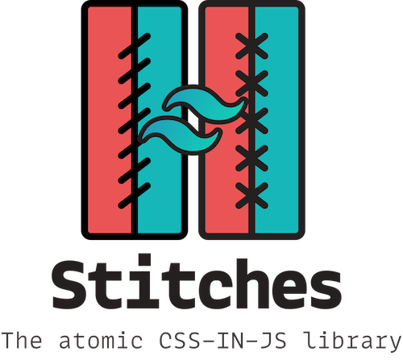

<p align="center">
  
</p>

Use stitches to build Tailwind apps

Read more about stitches at [@stitches/css](https://github.com/christianalfoni/stitches/tree/master/packages/css).

## Why

Tailwinds atomic mindset moved to a CSS-IN-JS library:

- No build step, just start using it
- No specificity issues
- No purge issues
- Small payload, about 10kb
- Use any pseudo selectors with any utility
- Automatically creates the critical CSS when used with SSR
- Can reduce payload even more with treeshaking utils and theme values
- Typed API, also when creating custom themes

## Get started

Load your page with the normalized CSS of Tailwind: https://cdnjs.cloudflare.com/ajax/libs/tailwindcss/1.2.0/base.css.

`npm install @stitches/css @stitches/tailwind`

```ts
// index.ts
import { createCss } from "@stitches/css";
import { tailwind } from "@stitches/tailwind";

const css = createCss(tailwind);

css.compose(css.m(12), css.text("blue-500"));
```

## Configure

You can configure the Tailwind instance to have a custom theme, utils and even add new utils:

```ts
// css.ts
import { createCss } from "@stitches/css";
import { createConfig } from "@stitches/tailwind";
// Treeshake by including only specific utils
// import { text, flex } from "@stitches/tailwind/utils"
import * as utils from "@stitches/tailwind/utils";
// Treeshake by including only specific theme
// import { colors, spacing } from "@stitches/tailwind/theme"
import * as theme from "@stitches/tailwind/theme";

const config = createConfig({
  screens: {
    tablet: (cssRule) => `@media (min-width: 768px) { ${cssRule} }`,
    laptop: (cssRule) => `@media (min-width: 1024px) { ${cssRule} }`,
  },
  theme: {
    ...theme,
    container: {
      center: false,
    },
  },
  utils: utils,
});
```

## Theme

To create your own theme copy the [default theme](https://github.com/christianalfoni/stitches/blob/master/packages/tailwind/src/theme.ts) and make your changes.

Any key defined as **default** will allow you to call its consuming utility without a value, resulting in the default value.

### screens

```ts
export const screens = {
  sm: "640px",
  md: "768px",
  lg: "1024px",
  xl: "1280px",
};
```

### container

```ts
export const container = {
  center: false,
  padding: {
    default: "0",
    sm: "0",
    md: "0",
    lg: "0",
    xl: "0",
  },
};
```

### colors

```ts
export const colors = {
  transparent: "transparent",
  current: "currentColor",
  black: "#000",
  white: "#fff",
  "gray-100": "#f7fafc",
  "gray-200": "#edf2f7",
  "gray-300": "#e2e8f0",
  "gray-400": "#cbd5e0",
  "gray-500": "#a0aec0",
  "gray-600": "#718096",
  "gray-700": "#4a5568",
  "gray-800": "#2d3748",
  "gray-900": "#1a202c",
  "red-100": "#fff5f5",
  "red-200": "#fed7d7",
  "red-300": "#feb2b2",
  "red-400": "#fc8181",
  "red-500": "#f56565",
  "red-600": "#e53e3e",
  "red-700": "#c53030",
  "red-800": "#9b2c2c",
  "red-900": "#742a2a",
  "orange-100": "#fffaf0",
  "orange-200": "#feebc8",
  "orange-300": "#fbd38d",
  "orange-400": "#f6ad55",
  "orange-500": "#ed8936",
  "orange-600": "#dd6b20",
  "orange-700": "#c05621",
  "orange-800": "#9c4221",
  "orange-900": "#7b341e",
  "yellow-100": "#fffff0",
  "yellow-200": "#fefcbf",
  "yellow-300": "#faf089",
  "yellow-400": "#f6e05e",
  "yellow-500": "#ecc94b",
  "yellow-600": "#d69e2e",
  "yellow-700": "#b7791f",
  "yellow-800": "#975a16",
  "yellow-900": "#744210",
  "green-100": "#f0fff4",
  "green-200": "#c6f6d5",
  "green-300": "#9ae6b4",
  "green-400": "#68d391",
  "green-500": "#48bb78",
  "green-600": "#38a169",
  "green-700": "#2f855a",
  "green-800": "#276749",
  "green-900": "#22543d",
  "teal-100": "#e6fffa",
  "teal-200": "#b2f5ea",
  "teal-300": "#81e6d9",
  "teal-400": "#4fd1c5",
  "teal-500": "#38b2ac",
  "teal-600": "#319795",
  "teal-700": "#2c7a7b",
  "teal-800": "#285e61",
  "teal-900": "#234e52",
  "blue-100": "#ebf8ff",
  "blue-200": "#bee3f8",
  "blue-300": "#90cdf4",
  "blue-400": "#63b3ed",
  "blue-500": "#4299e1",
  "blue-600": "#3182ce",
  "blue-700": "#2b6cb0",
  "blue-800": "#2c5282",
  "blue-900": "#2a4365",
  "indigo-100": "#ebf4ff",
  "indigo-200": "#c3dafe",
  "indigo-300": "#a3bffa",
  "indigo-400": "#7f9cf5",
  "indigo-500": "#667eea",
  "indigo-600": "#5a67d8",
  "indigo-700": "#4c51bf",
  "indigo-800": "#434190",
  "indigo-900": "#3c366b",
  "purple-100": "#faf5ff",
  "purple-200": "#e9d8fd",
  "purple-300": "#d6bcfa",
  "purple-400": "#b794f4",
  "purple-500": "#9f7aea",
  "purple-600": "#805ad5",
  "purple-700": "#6b46c1",
  "purple-800": "#553c9a",
  "purple-900": "#44337a",
  "pink-100": "#fff5f7",
  "pink-200": "#fed7e2",
  "pink-300": "#fbb6ce",
  "pink-400": "#f687b3",
  "pink-500": "#ed64a6",
  "pink-600": "#d53f8c",
  "pink-700": "#b83280",
  "pink-800": "#97266d",
  "pink-900": "#702459",
};
```

### spacing

```ts
export const spacing = {
  px: "1px",
  0: "0",
  1: "0.25rem",
  2: "0.5rem",
  3: "0.75rem",
  4: "1rem",
  5: "1.25rem",
  6: "1.5rem",
  8: "2rem",
  10: "2.5rem",
  12: "3rem",
  16: "4rem",
  20: "5rem",
  24: "6rem",
  32: "8rem",
  40: "10rem",
  48: "12rem",
  56: "14rem",
  64: "16rem",
};
```

### backgroundColor

```ts
export const backgroundColor = colors;
```

### backgroundPosition

```ts
export const backgroundPosition = {
  bottom: "bottom",
  center: "center",
  left: "left",
  "left-bottom": "left bottom",
  "left-top": "left top",
  right: "right",
  "right-bottom": "right bottom",
  "right-top": "right top",
  top: "top",
};
```

### backgroundSize

```ts
export const backgroundSize = {
  auto: "auto",
  cover: "cover",
  contain: "contain",
};
```

### borderColor

```ts
export const borderColor = {
  ...colors,
  "gray-300": "currentColor",
};
```

### borderRadius

```ts
export const borderRadius = {
  none: "0",
  sm: "0.125rem",
  default: "0.25rem",
  md: "0.375rem",
  lg: "0.5rem",
  full: "9999px",
};
```

### borderWidth

```ts
export const borderWidth = {
  default: "1px",
  0: "0",
  2: "2px",
  4: "4px",
  8: "8px",
};
```

### boxShadow

```ts
export const boxShadow = {
  xs: "0 0 0 1px rgba(0, 0, 0, 0.05)",
  sm: "0 1px 2px 0 rgba(0, 0, 0, 0.05)",
  default: "0 1px 3px 0 rgba(0, 0, 0, 0.1), 0 1px 2px 0 rgba(0, 0, 0, 0.06)",
  md: "0 4px 6px -1px rgba(0, 0, 0, 0.1), 0 2px 4px -1px rgba(0, 0, 0, 0.06)",
  lg: "0 10px 15px -3px rgba(0, 0, 0, 0.1), 0 4px 6px -2px rgba(0, 0, 0, 0.05)",
  xl:
    "0 20px 25px -5px rgba(0, 0, 0, 0.1), 0 10px 10px -5px rgba(0, 0, 0, 0.04)",
  "2xl": "0 25px 50px -12px rgba(0, 0, 0, 0.25)",
  inner: "inset 0 2px 4px 0 rgba(0, 0, 0, 0.06)",
  outline: "0 0 0 3px rgba(66, 153, 225, 0.5)",
  none: "none",
};
```

### cursor

```ts
export const cursor = {
  default: "default",
  auto: "auto",
  pointer: "pointer",
  wait: "wait",
  text: "text",
  move: "move",
  "not-allowed": "not-allowed",
};
```

### divideColor

```ts
export const divideColor = borderColor;
```

### divideWidth

```ts
export const divideWidth = borderWidth;
```

### fill

```ts
export const fill = {
  current: "currentColor",
};
```

### flex

```ts
export const flex = {
  initial: [0, 1, "auto"],
  auto: [1, 1, "auto"],
  none: [0, 0, "auto"],
  1: [1, 1, "0%"],
};
```

### flexGrow

```ts
export const flexGrow = {
  0: "0",
  default: "1",
};
```

### flexShrink

```ts
export const flexShrink = {
  0: "0",
  default: "1",
};
```

### fontFamily

```ts
export const fontFamily = {
  sans: [
    "system-ui",
    "-apple-system",
    "BlinkMacSystemFont",
    '"Segoe UI"',
    "Roboto",
    '"Helvetica Neue"',
    "Arial",
    '"Noto Sans"',
    "sans-serif",
    '"Apple Color Emoji"',
    '"Segoe UI Emoji"',
    '"Segoe UI Symbol"',
    '"Noto Color Emoji"',
  ],
  serif: ["Georgia", "Cambria", '"Times New Roman"', "Times", "serif"],
  mono: [
    "Menlo",
    "Monaco",
    "Consolas",
    '"Liberation Mono"',
    '"Courier New"',
    "monospace",
  ],
};
```

### fontSize

```ts
export const fontSize = {
  xs: "0.75rem",
  sm: "0.875rem",
  base: "1rem",
  lg: "1.125rem",
  xl: "1.25rem",
  "2xl": "1.5rem",
  "3xl": "1.875rem",
  "4xl": "2.25rem",
  "5xl": "3rem",
  "6xl": "4rem",
};
```

### fontWeight

```ts
export const fontWeight = {
  hairline: "100",
  thin: "200",
  light: "300",
  normal: "400",
  medium: "500",
  semibold: "600",
  bold: "700",
  extrabold: "800",
  black: "900",
};
```

### height

```ts
export const height = {
  auto: "auto",
  ...spacing,
  full: "100%",
  screen: "100vh",
};
```

### inset

```ts
export const inset = {
  0: "0",
  auto: "auto",
};
```

### letterSpacing

```ts
export const letterSpacing = {
  tighter: "-0.05em",
  tight: "-0.025em",
  normal: "0",
  wide: "0.025em",
  wider: "0.05em",
  widest: "0.1em",
};
```

### lineHeight

```ts
export const lineHeight = {
  none: "1",
  tight: "1.25",
  snug: "1.375",
  normal: "1.5",
  relaxed: "1.625",
  loose: "2",
  3: ".75rem",
  4: "1rem",
  5: "1.25rem",
  6: "1.5rem",
  7: "1.75rem",
  8: "2rem",
  9: "2.25rem",
  10: "2.5rem",
};
```

### listStyleType

```ts
export const listStyleType = {
  none: "none",
  disc: "disc",
  decimal: "decimal",
};
```

### margin

```ts
export const margin = {
  auto: "auto",
  ...spacing,
  ...negativeSpacing,
};
```

### maxHeight

```ts
export const maxHeight = {
  full: "100%",
  screen: "100vh",
};
```

### maxWidth

```ts
export const maxWidth = {
  none: "none",
  xs: "20rem",
  sm: "24rem",
  md: "28rem",
  lg: "32rem",
  xl: "36rem",
  "2xl": "42rem",
  "3xl": "48rem",
  "4xl": "56rem",
  "5xl": "64rem",
  "6xl": "72rem",
  full: "100%",
  "screen-sm": screens.sm,
  "screen-md": screens.md,
  "screen-lg": screens.lg,
  "screen-xl": screens.xl,
};
```

### minHeight

```ts
export const minHeight = {
  0: "0",
  full: "100%",
  screen: "100vh",
};
```

### minWidth

```ts
export const minWidth = {
  0: "0",
  full: "100%",
};
```

### objectPosition

```ts
export const objectPosition = {
  bottom: "bottom",
  center: "center",
  left: "left",
  "left-bottom": "left bottom",
  "left-top": "left top",
  right: "right",
  "right-bottom": "right bottom",
  "right-top": "right top",
  top: "top",
};
```

### opacity

```ts
export const opacity = {
  0: "0",
  25: "0.25",
  50: "0.5",
  75: "0.75",
  100: "1",
};
```

### order

```ts
export const order = {
  first: "-9999",
  last: "9999",
  none: "0",
  1: "1",
  2: "2",
  3: "3",
  4: "4",
  5: "5",
  6: "6",
  7: "7",
  8: "8",
  9: "9",
  10: "10",
  11: "11",
  12: "12",
};
```

### padding

```ts
export const padding = spacing;
```

### placeholderColor

```ts
export const placeholderColor = colors;
```

### space

```ts
export const space = spacing;
```

### stroke

```ts
export const stroke = {
  current: "currentColor",
};
```

### strokeWidth

```ts
export const strokeWidth = {
  0: "0",
  1: "1",
  2: "2",
};
```

### textColor

```ts
export const textColor = colors;
```

### width

```ts
export const width = {
  auto: "auto",
  ...spacing,
  "1/2": "50%",
  "1/3": "33.333333%",
  "2/3": "66.666667%",
  "1/4": "25%",
  "2/4": "50%",
  "3/4": "75%",
  "1/5": "20%",
  "2/5": "40%",
  "3/5": "60%",
  "4/5": "80%",
  "1/6": "16.666667%",
  "2/6": "33.333333%",
  "3/6": "50%",
  "4/6": "66.666667%",
  "5/6": "83.333333%",
  "1/12": "8.333333%",
  "2/12": "16.666667%",
  "3/12": "25%",
  "4/12": "33.333333%",
  "5/12": "41.666667%",
  "6/12": "50%",
  "7/12": "58.333333%",
  "8/12": "66.666667%",
  "9/12": "75%",
  "10/12": "83.333333%",
  "11/12": "91.666667%",
  full: "100%",
  screen: "100vw",
};
```

### zIndex

```ts
export const zIndex = {
  auto: "auto",
  0: "0",
  10: "10",
  20: "20",
  30: "30",
  40: "40",
  50: "50",
};
```

### gap

```ts
export const gap = {
  px: "1px",
  0: "0",
  1: "0.25rem",
  2: "0.5rem",
  3: "0.75rem",
  4: "1rem",
  5: "1.25rem",
  6: "1.5rem",
  8: "2rem",
  10: "2.5rem",
  12: "3rem",
  16: "4rem",
  20: "5rem",
  24: "6rem",
  32: "8rem",
  40: "10rem",
  48: "12rem",
  56: "14rem",
  64: "16rem",
};
```

### gridTemplateColumns

```ts
export const gridTemplateColumns = {
  none: "none",
  1: "repeat(1, minmax(0, 1fr))",
  2: "repeat(2, minmax(0, 1fr))",
  3: "repeat(3, minmax(0, 1fr))",
  4: "repeat(4, minmax(0, 1fr))",
  5: "repeat(5, minmax(0, 1fr))",
  6: "repeat(6, minmax(0, 1fr))",
  7: "repeat(7, minmax(0, 1fr))",
  8: "repeat(8, minmax(0, 1fr))",
  9: "repeat(9, minmax(0, 1fr))",
  10: "repeat(10, minmax(0, 1fr))",
  11: "repeat(11, minmax(0, 1fr))",
  12: "repeat(12, minmax(0, 1fr))",
};
```

### gridColumn

```ts
export const gridColumn = {
  auto: "auto",
  "span-1": "span 1 / span 1",
  "span-2": "span 2 / span 2",
  "span-3": "span 3 / span 3",
  "span-4": "span 4 / span 4",
  "span-5": "span 5 / span 5",
  "span-6": "span 6 / span 6",
  "span-7": "span 7 / span 7",
  "span-8": "span 8 / span 8",
  "span-9": "span 9 / span 9",
  "span-10": "span 10 / span 10",
  "span-11": "span 11 / span 11",
  "span-12": "span 12 / span 12",
};
```

### gridColumnStart

```ts
export const gridColumnStart = {
  auto: "auto",
  1: "1",
  2: "2",
  3: "3",
  4: "4",
  5: "5",
  6: "6",
  7: "7",
  8: "8",
  9: "9",
  10: "10",
  11: "11",
  12: "12",
  13: "13",
};
```

### gridColumnEnd

```ts
export const gridColumnEnd = {
  auto: "auto",
  1: "1",
  2: "2",
  3: "3",
  4: "4",
  5: "5",
  6: "6",
  7: "7",
  8: "8",
  9: "9",
  10: "10",
  11: "11",
  12: "12",
  13: "13",
};
```

### gridTemplateRows

```ts
export const gridTemplateRows = {
  none: "none",
  1: "repeat(1, minmax(0, 1fr))",
  2: "repeat(2, minmax(0, 1fr))",
  3: "repeat(3, minmax(0, 1fr))",
  4: "repeat(4, minmax(0, 1fr))",
  5: "repeat(5, minmax(0, 1fr))",
  6: "repeat(6, minmax(0, 1fr))",
};
```

### gridRow

```ts
export const gridRow = {
  auto: "auto",
  "span-1": "span 1 / span 1",
  "span-2": "span 2 / span 2",
  "span-3": "span 3 / span 3",
  "span-4": "span 4 / span 4",
  "span-5": "span 5 / span 5",
  "span-6": "span 6 / span 6",
};
```

### gridRowStart

```ts
export const gridRowStart = {
  auto: "auto",
  1: "1",
  2: "2",
  3: "3",
  4: "4",
  5: "5",
  6: "6",
  7: "7",
};
```

### gridRowEnd

```ts
export const gridRowEnd = {
  auto: "auto",
  1: "1",
  2: "2",
  3: "3",
  4: "4",
  5: "5",
  6: "6",
  7: "7",
};
```

### transformOrigin

```ts
export const transformOrigin = {
  center: "center",
  top: "top",
  "top-right": "top right",
  right: "right",
  "bottom-right": "bottom right",
  bottom: "bottom",
  "bottom-left": "bottom left",
  left: "left",
  "top-left": "top left",
};
```

### scale

```ts
export const scale = {
  0: "0",
  50: ".5",
  75: ".75",
  90: ".9",
  95: ".95",
  100: "1",
  105: "1.05",
  110: "1.1",
  125: "1.25",
  150: "1.5",
};
```

### rotate

```ts
export const rotate = {
  [-180]: "-180deg",
  [-90]: "-90deg",
  [-45]: "-45deg",
  0: "0",
  45: "45deg",
  90: "90deg",
  180: "180deg",
};
```

### translate

```ts
export const translate = {
  ...spacing,
  ...negativeSpacing,
  "-full": "-100%",
  "-1/2": "-50%",
  "1/2": "50%",
  full: "100%",
};
```

### skew

```ts
export const skew = {
  [-12]: "-12deg",
  [-6]: "-6deg",
  [-3]: "-3deg",
  0: "0",
  3: "3deg",
  6: "6deg",
  12: "12deg",
};
```

### transitionProperty

```ts
export const transitionProperty = {
  none: "none",
  all: "all",
  default:
    "background-color, border-color, color, fill, stroke, opacity, box-shadow, transform",
  colors: "background-color, border-color, color, fill, stroke",
  opacity: "opacity",
  shadow: "box-shadow",
  transform: "transform",
};
```

### transitionTimingFunction

```ts
export const transitionTimingFunction = {
  linear: "linear",
  in: "cubic-bezier(0.4, 0, 1, 1)",
  out: "cubic-bezier(0, 0, 0.2, 1)",
  "in-out": "cubic-bezier(0.4, 0, 0.2, 1)",
};
```

### transitionDuration

```ts
export const transitionDuration = {
  75: "75ms",
  100: "100ms",
  150: "150ms",
  200: "200ms",
  300: "300ms",
  500: "500ms",
  700: "700ms",
  1000: "1000ms",
};
```

### transitionDelay

```ts
export const transitionDelay = {
  75: "75ms",
  100: "100ms",
  150: "150ms",
  200: "200ms",
  300: "300ms",
  500: "500ms",
  700: "700ms",
  1000: "1000ms",
};
```

## Utilities

### absolute

The element is positioned relative to the nearest non static parent.

| Argument | Properties          |
| :------- | :------------------ |
|          | position: absolute; |

### align

The element vertical alignment.

| Argument    | Properties                   |
| :---------- | :--------------------------- |
| baseline    | vertical-align: baseline;    |
| top         | vertical-align: top;         |
| middle      | vertical-align: middle;      |
| bottom      | vertical-align: bottom;      |
| text-top    | vertical-align: text-top;    |
| text-bottom | vertical-align: text-bottom; |

### antialiased

The element renders test with antialiasing.

| Argument | Properties                                                               |
| :------- | :----------------------------------------------------------------------- |
|          | -webkit-font-smoothing: antialiased; -moz-osx-font-smoothing: grayscale; |

### appearance

The element appearance.

| Argument | Properties        |
| :------- | :---------------- |
| none     | appearance: none; |

### bg

The element background attachment, color, repeat, size and position.

| Argument                                  | Properties                       |
| :---------------------------------------- | :------------------------------- |
| fixed                                     | background-attachment: fixed;    |
| local                                     | background-attachment: local;    |
| scroll                                    | background-attachment: scroll;   |
| repeat                                    | background-repeat: repeat;       |
| no-repeat                                 | background-repeat: no-repeat;    |
| repeat-x                                  | background-repeat: repeat-x;     |
| repeat-y                                  | background-repeat: repeat-y;     |
| repeat-round                              | background-repeat: repeat-round; |
| repeat-space                              | background-repeat: repeat-space; |
| [backgroundPosition](#backgroundposition) | background-position: **value**;  |
| [backgroundSize](#backgroundsize)         | background-size: **value**;      |
| [backgroundColor](#backgroundcolor)       | background-color: **value**;     |

### block

The element takes up as much space as possible.

| Argument | Properties      |
| :------- | :-------------- |
|          | display: block; |

### border

The element border width and color.

| Argument                    | Properties                                                                                                                |
| :-------------------------- | :------------------------------------------------------------------------------------------------------------------------ |
| collapse                    | border-collapse: collapse;                                                                                                |
| separate                    | border-collapse: separate;                                                                                                |
| [borderWidth](#borderwidth) | border-top-width: **value**; border-right-width: **value**; border-bottom-width: **value**; border-left-width: **value**; |
| [borderColor](#bordercolor) | border-top-color: **value**; border-right-color: **value**; border-bottom-color: **value**; border-left-color: **value**; |

### borderB

The element bottom border width.

| Argument                    | Properties                      |
| :-------------------------- | :------------------------------ |
| [borderWidth](#borderwidth) | border-bottom-width: **value**; |
| [borderColor](#bordercolor) | border-bottom-color: **value**; |

### borderL

The element left border width.

| Argument                    | Properties                    |
| :-------------------------- | :---------------------------- |
| [borderWidth](#borderwidth) | border-left-width: **value**; |
| [borderColor](#bordercolor) | border-left-color: **value**; |

### borderR

The element right border width.

| Argument                    | Properties                     |
| :-------------------------- | :----------------------------- |
| [borderWidth](#borderwidth) | border-right-width: **value**; |
| [borderColor](#bordercolor) | border-right-color: **value**; |

### borderT

The element top border width.

| Argument                    | Properties                   |
| :-------------------------- | :--------------------------- |
| [borderWidth](#borderwidth) | border-top-width: **value**; |
| [borderColor](#bordercolor) | border-top-color: **value**; |

### bottom

The element, given it is absolutely positioned, will be anchored to the bottom of its relative parent.

| Argument        | Properties         |
| :-------------- | :----------------- |
| [inset](#inset) | bottom: **value**; |

### box

The element border and padding inclusion when you give it a height or width.

| Argument | Properties               |
| :------- | :----------------------- |
| border   | box-sizing: border-box;  |
| content  | box-sizing: content-box; |

### breakText

The element word break behaviour.

**note!** It is named **breakText** as **break** is a keyword in JavaScript.

| Argument | Properties                                 |
| :------- | :----------------------------------------- |
| normal   | word-break: normal; overflow-wrap: normal; |
| words    | overflow-wrap: break-word;                 |
| all      | word-break: all;                           |

### capitalize

The element text is capitalized.

| Argument | Properties                  |
| :------- | :-------------------------- |
|          | text-transform: capitalize; |

### clear

The element will be positioned below any preceeding floating elements.

| Argument | Properties    |
| :------- | :------------ |
| right    | clear: right; |
| left     | clear: left;  |
| both     | clear: both;  |

### clearfix

The elements floating in this element will not overflow.

| Argument | Properties                                           |
| :------- | :--------------------------------------------------- |
|          | :after { content: ""; display: table; clear: both; } |

### col

The element column span in a grid container.

| Argument                  | Properties              |
| :------------------------ | :---------------------- |
| [gridColumn](#gridcolumn) | grid-column: **value**; |

### colEnd

The element column start index in a grid container.

| Argument                        | Properties                  |
| :------------------------------ | :-------------------------- |
| [gridColumnEnd](#gridcolumnend) | grid-column-end: **value**; |

### colGap

The element row gap size, given it is in a grid.

| Argument    | Properties             |
| :---------- | :--------------------- |
| [gap](#gap) | column-gap: **value**; |

### colStart

The element column start index in a grid container.

| Argument                            | Properties                    |
| :---------------------------------- | :---------------------------- |
| [gridColumnStart](#gridcolumnstart) | grid-column-start: **value**; |

### container

A container that sets its `max-width` based on [screens](#screens).

| Breakpoints | Properties         |
| :---------- | :----------------- |
| none        | width: 100%;       |
| sm (640px)  | max-width: 640px;  |
| md (768px)  | max-width: 768px;  |
| lg (1024px) | max-width: 1024px; |
| xl (1280px) | max-width: 1280px; |

### content

The element lines positioned when flex.

| Argument      | Properties                    |
| :------------ | :---------------------------- |
| start         | align-content: flex-start;    |
| center        | align-content: center;        |
| end           | align-content: flex-end;      |
| space-between | align-content: space-between; |
| around        | align-content: space-around;  |

### cursor

The element cursor.

| Argument          | Properties         |
| :---------------- | :----------------- |
| [cursor](#cursor) | cursor: **value**; |

### delay

The element transition delay.

| Argument                            | Properties                   |
| :---------------------------------- | :--------------------------- |
| [transitionDelay](#transitiondelay) | transition-delay: **value**; |

### divideBottom

The element children bottom border divide.

Default selector: **> \* + \***

| Argument                    | Properties                      |
| :-------------------------- | :------------------------------ |
| [divideWidth](#dividewidth) | border-bottom-width: **value**; |
| [divideColor](#dividecolor) | border-bottom-color: **value**; |

### divideLeft

The element children left border divide.

Default selector: **> \* + \***

| Argument                    | Properties                    |
| :-------------------------- | :---------------------------- |
| [divideWidth](#dividewidth) | border-left-width: **value**; |
| [divideColor](#dividecolor) | border-left-color: **value**; |

### divideRight

The element children right border divide.

Default selector: **> \* + \***

| Argument                    | Properties                     |
| :-------------------------- | :----------------------------- |
| [divideWidth](#dividewidth) | border-right-width: **value**; |
| [divideColor](#dividecolor) | border-right-color: **value**; |

### divideTop

The element children top border divide.

Default selector: **> \* + \***

| Argument                    | Properties                   |
| :-------------------------- | :--------------------------- |
| [divideWidth](#dividewidth) | border-top-width: **value**; |
| [divideColor](#dividecolor) | border-top-color: **value**; |

### duration

The element transition duration.

| Argument                                  | Properties                      |
| :---------------------------------------- | :------------------------------ |
| [transitionDuration](#transitionduration) | transition-duration: **value**; |

### ease

The element transition timing function.

| Argument                                              | Properties                             |
| :---------------------------------------------------- | :------------------------------------- |
| [transitionTimingFunction](#transitiontimingfunction) | transition-timing-function: **value**; |

### fill

The element fill.

| Argument      | Properties       |
| :------------ | :--------------- |
| [fill](#fill) | fill: **value**; |

### fixed

The element is positioned relative to the browser window.

| Argument | Properties       |
| :------- | :--------------- |
|          | position: fixed; |

### flex

The element flex behaviour, it being a flex container or a flex child.

| Argument      | Properties                                                                    |
| :------------ | :---------------------------------------------------------------------------- |
|               | display: flex;                                                                |
| row           | display: flex; flex-direction: row;                                           |
| row-reverse   | display: flex; flex-direction: row-reverse;                                   |
| col           | display: flex; flex-direction: column;                                        |
| col-reverse   | display: flex; flex-direction: column-reverse;                                |
| [flex](#flex) | flex-grow: **value[0]**; flex-shrink: **value[1]**; flex-basis: **value[2]**; |

### float

The element is floated in its container.

| Argument | Properties    |
| :------- | :------------ |
| right    | float: right; |
| left     | float: left;  |
| none     | float: none;  |

### flowRoot

The element has its own [block formatting context](https://developer.mozilla.org/en-US/docs/Web/Guide/CSS/Block_formatting_context)

| Argument | Properties          |
| :------- | :------------------ |
|          | display: flow-root; |

### font

The element font family and weight.

| Argument                  | Properties              |
| :------------------------ | :---------------------- |
| [fontFamily](#fontfamily) | font-family: **value**; |
| [fontWeight](#fontweight) | font-weight: **value**; |

### gap

The element gap size, given it is in a grid.

| Argument    | Properties      |
| :---------- | :-------------- |
| [gap](#gap) | gap: **value**; |

### grid

The element is a grid.

| Argument | Properties     |
| :------- | :------------- |
|          | display: grid; |

### gridCols

The element grid column size.

| Argument                                    | Properties                        |
| :------------------------------------------ | :-------------------------------- |
| [gridTemplateColumns](#gridtemplatecolumns) | grid-template-columns: **value**; |

### gridFlow

The element children are auto placed.

| Argument  | Properties                    |
| :-------- | :---------------------------- |
| row       | grid-auto-flow: row;          |
| col       | grid-auto-flow: column;       |
| row-dense | grid-auto-flow: row dense;    |
| col-dense | grid-auto-flow: column-dense; |

### gridRows

The element grid row size.

| Argument                              | Properties                     |
| :------------------------------------ | :----------------------------- |
| [gridTemplateRows](#gridtemplaterows) | grid-template-rows: **value**; |

### grow

The element flex growth.

| Argument              | Properties            |
| :-------------------- | :-------------------- |
| [flexGrow](#flexgrow) | flex-grow: **value**; |

### h (value, selector?)

The element height.

| Argument | Properties         |
| :------- | :----------------- |
| [h](#h)  | height: **value**; |

### hidden

The element is hidden.

| Argument | Properties     |
| :------- | :------------- |
|          | display: none; |

### inline

The element is displayed as inline.

| Argument | Properties       |
| :------- | :--------------- |
|          | display: inline; |

### inlineBlock

The element is displayed as inline block.

| Argument | Properties             |
| :------- | :--------------------- |
|          | display: inline-block; |

### inlineFlex

The element is displayed as inline flex.

| Argument | Properties            |
| :------- | :-------------------- |
|          | display: inline-flex; |

### inlineGrid

The element is displayed as an inline grid.

| Argument | Properties            |
| :------- | :-------------------- |
|          | display: inline-grid; |

### inset

The element, given it is absolutely positioned, will be anchored to its relative parent.

| Argument        | Properties                                                            |
| :-------------- | :-------------------------------------------------------------------- |
| [inset](#inset) | top: **value**; right: **value**; bottom: **value**; left: **value**; |

### insetX

The element, given it is absolutely positioned, will be anchored to the left and right of its relative parent.

Uses **theme.inset**

| Argument        | Properties                         |
| :-------------- | :--------------------------------- |
| [inset](#inset) | right: **value**; left: **value**; |

### insetY

The element, given it is absolutely positioned, will be anchored to the top and bottom of its relative parent.

Uses **theme.inset**

| Argument        | Properties                         |
| :-------------- | :--------------------------------- |
| [inset](#inset) | top: **value**; bottom: **value**; |

### invisible

The element is invisible.

| Argument | Properties          |
| :------- | :------------------ |
|          | visibility: hidden; |

### italic

The element renders text in italic.

| Argument | Properties          |
| :------- | :------------------ |
|          | font-style: italic; |

### items

The element children cross axis behaviour.

| Argument | Properties               |
| :------- | :----------------------- |
| stretch  | align-items: stretch;    |
| start    | align-items: flex-start; |
| center   | align-items: center;     |
| end      | align-items: flex-end;   |
| baseline | align-items: baseline;   |

### justify

The element children main axis behaviour.

| Argument | Properties                      |
| :------- | :------------------------------ |
| start    | justify-content: flex-start;    |
| center   | justify-content: center;        |
| end      | justify-content: flex-end;      |
| between  | justify-content: space-between; |
| around   | justify-content: space-around;  |

### leading

The element line height.

| Argument                  | Properties              |
| :------------------------ | :---------------------- |
| [lineHeight](#lineheight) | line-height: **value**; |

### left

The element, given it is absolutely positioned, will be anchored to the left of its relative parent.

| Argument        | Properties       |
| :-------------- | :--------------- |
| [inset](#inset) | left: **value**; |

### lineThrough

The element text decoration as line-through.

| Argument | Properties                     |
| :------- | :----------------------------- |
|          | text-decoration: line-through; |

### list

The element list type.

| Argument                        | Properties                    |
| :------------------------------ | :---------------------------- |
| inside                          | list-style-position: inside;  |
| outside                         | list-style-position: outside; |
| [listStyleType](#liststyletype) | line-style-type: **value**;   |

### lowercase

The element text is lower cased.

| Argument | Properties                 |
| :------- | :------------------------- |
|          | text-transform: lowercase; |

### m

The element margin.

| Argument          | Properties                                                                                        |
| :---------------- | :------------------------------------------------------------------------------------------------ |
| [margin](#margin) | margin-top: **value**; margin-right: **value**; margin-bottom: **value**; margin-left: **value**; |

### maxH

The element maximum height.

| Argument                | Properties             |
| :---------------------- | :--------------------- |
| [maxHeight](#maxheight) | max-height: **value**; |

### maxW

The element maximum width.

| Argument              | Properties            |
| :-------------------- | :-------------------- |
| [maxWidth](#maxwidth) | max-width: **value**; |

### mb

The element bottom margin.

| Argument          | Properties                |
| :---------------- | :------------------------ |
| [margin](#margin) | margin-bottom: **value**; |

### minH

The element minimum height.

| Argument                | Properties             |
| :---------------------- | :--------------------- |
| [minHeight](#minheight) | min-height: **value**; |

### minW

The element minimum width.

| Argument              | Properties            |
| :-------------------- | :-------------------- |
| [minwidth](#minwidth) | min-width: **value**; |

### ml

The element left margin.

| Argument          | Properties              |
| :---------------- | :---------------------- |
| [margin](#margin) | margin-left: **value**; |

### mr

The element right margin.

| Argument          | Properties               |
| :---------------- | :----------------------- |
| [margin](#margin) | margin-right: **value**; |

### mt

The element top margin.

| Argument          | Properties             |
| :---------------- | :--------------------- |
| [margin](#margin) | margin-top: **value**; |

### mx

The element left and right margin.

| Argument          | Properties                                       |
| :---------------- | :----------------------------------------------- |
| [margin](#margin) | margin-right: **value**; margin-left: **value**; |

### my

The element top and bottom margin.

| Argument          | Properties                                       |
| :---------------- | :----------------------------------------------- |
| [margin](#margin) | margin-top: **value**; margin-bottom: **value**; |

### normalCase

The element has no text transform.

| Argument | Properties            |
| :------- | :-------------------- |
|          | text-transform: none; |

### notItalic

The element renders text in normal style.

| Argument | Properties          |
| :------- | :------------------ |
|          | font-style: normal; |

### notSrOnly

The element is not only visible on screenreaders.

| Argument | Properties                                                                                                              |
| :------- | :---------------------------------------------------------------------------------------------------------------------- |
|          | position: static; width: auto; height: auto; padding: 0; margin: 0; overflow: visible; clip: auto; white-space: normal; |
|          |

### noUnderline

The element text decoration as none.

| Argument | Properties             |
| :------- | :--------------------- |
|          | text-decoration: none; |

### table

The element is displayed as a table element.

| Argument     | Properties                   |
| :----------- | :--------------------------- |
|              | display: table;              |
| caption      | display: table-caption;      |
| cell         | display: table-cell;         |
| col          | display: table-column;       |
| col-group    | display: table-column-group; |
| footer-group | display: table-footer-group; |
| header-group | display: table-header-group; |
| row-group    | display: table-row-group;    |
| row          | display: table-row;          |
| auto         | table-layout: auto;          |
| fixed        | table-layout: fixed;         |

### object

The element content resize behaviour and how the content will be positioned.

| Argument                          | Properties                  |
| :-------------------------------- | :-------------------------- |
| contain                           | object-fit: contain;        |
| cover                             | object-fit: cover;          |
| fill                              | object-fit: fill;           |
| none                              | object-fit: none;           |
| scale-down                        | object-fit: scale-down;     |
| [objectPosition](#objectposition) | object-position: **value**; |

### opacity

The element box shadow.

| Argument            | Properties          |
| :------------------ | :------------------ |
| [opacity](#opacity) | opacity: **value**; |

### order

The element order in a flex container.

| Argument        | Properties        |
| :-------------- | :---------------- |
| [order](#order) | order: **value**; |

### origin

The element origin transform.

| Argument                            | Properties                   |
| :---------------------------------- | :--------------------------- |
| [transformOrigin](#transformorigin) | transform-origin: **value**; |

### outline

The element outline.

| Argument | Properties     |
| :------- | :------------- |
| none     | outline: none; |

### oveflow

The element behaviour of overflowing content in both directions.

| Argument | Properties                                |
| :------- | :---------------------------------------- |
| auto     | overflow-x: auto; overflow-y: auto;       |
| hidden   | overflow-x: hidden; overflow-y: hidden;   |
| visible  | overflow-x: visible; overflow-y: visible; |
| scroll   | overflow-x: scroll; overflow-y: scroll;   |

### oveflowX

The element behaviour of overflowing content in horizontal direction.

| Argument | Properties           |
| :------- | :------------------- |
| auto     | overflow-x: auto;    |
| hidden   | overflow-x: hidden;  |
| visible  | overflow-x: visible; |
| scroll   | overflow-x: scroll;  |

### oveflowY

The element behaviour of overflowing content vertical direction.

| Argument | Properties           |
| :------- | :------------------- |
| auto     | overflow-y: auto;    |
| hidden   | overflow-y: hidden;  |
| visible  | overflow-y: visible; |
| scroll   | overflow-y: scroll;  |

### p

The element padding.

| Argument            | Properties                                                                                            |
| :------------------ | :---------------------------------------------------------------------------------------------------- |
| [padding](#padding) | padding-top: **value**; padding-right: **value**; padding-bottom: **value**; padding-left: **value**; |

### pb

The element bottom padding.

| Argument            | Properties                 |
| :------------------ | :------------------------- |
| [padding](#padding) | padding-bottom: **value**; |

### pl

The element left padding.

| Argument            | Properties               |
| :------------------ | :----------------------- |
| [padding](#padding) | padding-left: **value**; |

### placeholder

The element placeholder color.

Default selector: **::placeholder**

| Argument                              | Properties        |
| :------------------------------------ | :---------------- |
| [placeholderColor](#placeholdercolor) | color: **value**; |

### pointerEvents

The element pointer events.

| Argument | Properties            |
| :------- | :-------------------- |
| none     | pointer-events: none; |
| auto     | pointer-events: auto; |

### pr

The element right padding.

| Argument            | Properties                |
| :------------------ | :------------------------ |
| [padding](#padding) | padding-right: **value**; |

### pt

The element top padding.

| Argument            | Properties              |
| :------------------ | :---------------------- |
| [padding](#padding) | padding-top: **value**; |

### px

The element left and right padding.

| Argument            | Properties                                         |
| :------------------ | :------------------------------------------------- |
| [padding](#padding) | padding-right: **value**; padding-left: **value**; |

### py

The element top and bottom padding.

| Argument            | Properties                                         |
| :------------------ | :------------------------------------------------- |
| [padding](#padding) | padding-top: **value**; padding-bottom: **value**; |

### resize

The element resize behaviour.

| Argument | Properties          |
| :------- | :------------------ |
|          | resize: both;       |
| none     | resize: none;       |
| y        | resize: vertical;   |
| x        | resize: horizontal; |

### relative

The element is positioned normally and children elements can be positioned relative to this element.

| Argument | Properties          |
| :------- | :------------------ |
|          | position: relative; |

### right

The element, given it is absolutely positioned, will be anchored to the right of its relative parent.

| Argument        | Properties        |
| :-------------- | :---------------- |
| [inset](#inset) | right: **value**; |

### rotate

The element rotate transform.

| Argument          | Properties                     |
| :---------------- | :----------------------------- |
| [rotate](#rotate) | --transform-rotate: **value**; |

### rounded

The element border radius.

| Argument                      | Properties                                                                                                                                          |
| :---------------------------- | :-------------------------------------------------------------------------------------------------------------------------------------------------- |
| [borderRadius](#borderradius) | border-top-left-radius: **value**; border-top-right-radius: **value**; border-bottom-right-radius: **value**; border-bottom-left-radius: **value**; |

### roundedB

The element bottom border radius.

| Argument                      | Properties                                                                   |
| :---------------------------- | :--------------------------------------------------------------------------- |
| [borderRadius](#borderradius) | border-bottom-right-radius: **value**; border-bottom-left-radius: **value**; |

### roundedBL

The element bottom left border radius.

| Argument                      | Properties                            |
| :---------------------------- | :------------------------------------ |
| [borderRadius](#borderradius) | border-bottom-left-radius: **value**; |

### roundedBR

The element bottom right border radius.

| Argument                      | Properties                             |
| :---------------------------- | :------------------------------------- |
| [borderRadius](#borderradius) | border-bottom-right-radius: **value**; |

### roundedL

The element left border radius.

| Argument                      | Properties                                                               |
| :---------------------------- | :----------------------------------------------------------------------- |
| [borderRadius](#borderradius) | border-top-left-radius: **value**; border-bottom-left-radius: **value**; |

### roundedR

The element right border radius.

| Argument                      | Properties                                                                 |
| :---------------------------- | :------------------------------------------------------------------------- |
| [borderRadius](#borderradius) | border-top-right-radius: **value**; border-bottom-right-radius: **value**; |

### roundedT

The element top border radius.

| Argument                      | Properties                                                             |
| :---------------------------- | :--------------------------------------------------------------------- |
| [borderRadius](#borderradius) | border-top-left-radius: **value**; border-top-right-radius: **value**; |

### roundedTL

The element top left border radius.

| Argument                      | Properties                         |
| :---------------------------- | :--------------------------------- |
| [borderRadius](#borderradius) | border-top-left-radius: **value**; |

### roundedTR

The element top right border radius.

| Argument                      | Properties                          |
| :---------------------------- | :---------------------------------- |
| [borderRadius](#borderradius) | border-top-right-radius: **value**; |

### row

The element row span in a grid container.

| Argument            | Properties           |
| :------------------ | :------------------- |
| [gridRow](#gridrow) | grid-row: **value**; |

### rowEnd

The element row end index in a grid container.

| Argument                  | Properties               |
| :------------------------ | :----------------------- |
| [gridRowEnd](#gridrowend) | grid-row-end: **value**; |

### rowGap

The element row gap size, given it is in a grid.

| Argument    | Properties          |
| :---------- | :------------------ |
| [gap](#gap) | row-gap: **value**; |

### rowStart

The element row start index in a grid container.

| Argument                      | Properties                 |
| :---------------------------- | :------------------------- |
| [gridRowStart](#gridrowstart) | grid-row-start: **value**; |

### scale

The element scale transform.

| Argument        | Properties                                                      |
| :-------------- | :-------------------------------------------------------------- |
| [scale](#scale) | --transform-scale-x: **value**; --transform-scale-y: **value**; |

### scaleX

The element scale transform on the X axis.

| Argument        | Properties                      |
| :-------------- | :------------------------------ |
| [scale](#scale) | --transform-scale-x: **value**; |

### scaleY

The element scale transform on the Y axis.

| Argument        | Properties                      |
| :-------------- | :------------------------------ |
| [scale](#scale) | --transform-scale-y: **value**; |

### scrolling

The element scroll behaviour.

| Argument | Properties                         |
| :------- | :--------------------------------- |
| touch    | -webkit-overflow-scrolling: touch; |
| auto     | -webkit-overflow-scrolling: auto;  |

### select

The element user selection behaviour.

| Argument | Properties         |
| :------- | :----------------- |
| none     | user-select: none; |
| text     | user-select: text; |
| all      | user-select: all;  |
| auto     | user-select: auto; |

### self

The element lines positioned when flex.

| Argument | Properties              |
| :------- | :---------------------- |
| auto     | align-self: auto;       |
| start    | align-self: flex-start; |
| center   | align-self: center;     |
| end      | align-self: flex-end;   |
| stretch  | align-self: stretch;    |

### shadow

The element box shadow.

| Argument                | Properties             |
| :---------------------- | :--------------------- |
| [boxShadow](#boxshadow) | box-shadow: **value**; |

### shrink

The element flex shrink.

| Argument                  | Properties              |
| :------------------------ | :---------------------- |
| [flexShrink](#flexshrink) | flex-shrink: **value**; |

### skewX

The element skew transform on the X axis.

| Argument      | Properties                     |
| :------------ | :----------------------------- |
| [skew](#skew) | --transform-skew-x: **value**; |

### skewY

The element skew transform on the Y axis.

| Argument      | Properties                     |
| :------------ | :----------------------------- |
| [skew](#skew) | --transform-skew-y: **value**; |

### spaceBottom

The element children spacing.

Default selector: **> \* + \***

| Argument          | Properties                |
| :---------------- | :------------------------ |
| [margin](#margin) | margin-bottom: **value**; |

### spaceLeft

The element children spacing.

Default selector: **> \* + \***

| Argument          | Properties              |
| :---------------- | :---------------------- |
| [margin](#margin) | margin-left: **value**; |

### spaceRight

The element children spacing.

Default selector: **> \* + \***

| Argument          | Properties               |
| :---------------- | :----------------------- |
| [margin](#margin) | margin-right: **value**; |

### spaceTop

The element children spacing.

Default selector: **> \* + \***

| Argument          | Properties             |
| :---------------- | :--------------------- |
| [margin](#margin) | margin-top: **value**; |

### srOnly

The element is only visible on screenreaders.

| Argument | Properties                                                                                                                                             |
| :------- | :----------------------------------------------------------------------------------------------------------------------------------------------------- |
|          | position: absolute; width: 1px; height: 1px; padding: 0; margin: -1px; overflow: hidden; clip: rect(0, 0, 0, 0); white-space: nowrap; border-width: 0; |

### staticPosition

The element is positioned normally, but children elements can not be positioned relative to this element.

**Note!** The reason it is not called **static** is becaues that is a keyword in JavaScript.

| Argument | Properties        |
| :------- | :---------------- |
|          | position: static; |

### sticky

The element is relative by default, but acts automatically as fixed when risk of going outside screen, until parent goes completely off screen.

| Argument | Properties        |
| :------- | :---------------- |
|          | position: sticky; |

### stroke

The element stroke.

| Argument                    | Properties               |
| :-------------------------- | :----------------------- |
| [stroke](#stroke)           | stroke: **value**;       |
| [strokeWidth](#strokewidth) | stroke-width: **value**; |

### subpixelAntialiased

The element renders text with subpixel antialiasing.

| Argument | Properties                                                   |
| :------- | :----------------------------------------------------------- |
|          | -webkit-font-smoothing: auto; -moz-osx-font-smoothing: auto; |

### text

The element text styling.

| Argument                | Properties             |
| :---------------------- | :--------------------- |
| left                    | text-align: left;      |
| center                  | text-align: center;    |
| right                   | text-align: right;     |
| justify                 | text-align: justify;   |
| [textColor](#textcolor) | color: **value**;      |
| [fontSize](#fontsize)   | font-size: **value**;  |

### top

The element, given it is absolutely positioned, will be anchored to the top of its relative parent.

| Argument        | Properties      |
| :-------------- | :-------------- |
| [inset](#inset) | top: **value**; |

### tracking

The element letter spacing.

| Argument                        | Properties                 |
| :------------------------------ | :------------------------- |
| [letterSpacing](#letterspacing) | letter-spacing: **value**; |

### transform

The element will transform.

| Argument | Properties                                                                                                                                                                                                                                                                                                                                                                                                                                |
| :------- | :---------------------------------------------------------------------------------------------------------------------------------------------------------------------------------------------------------------------------------------------------------------------------------------------------------------------------------------------------------------------------------------------------------------------------------------- |
|          | --transform-translate-x: 0; --transform-translate-y: 0; --transform-rotate: 0; --transform-skew-x: 0; --transform-skew-y: 0; --transform-scale-x: 0; --transform-scale-y: 0; transform: translateX(var(--transform-translate-x)) translateY(var(--transform-translate-y)) rotate(var(--transform-rotate)) skewX(var(--transform-skew-x)) skewY(var(--transform-skew-y)) scaleX(var(--transform-scale-x)) scaleY(var(--transform-scale-y)) |

### transition

The element transition property.

| Argument                                  | Properties                      |
| :---------------------------------------- | :------------------------------ |
| [transitionProperty](#transitionproperty) | transition-property: **value**; |

### translateX

The element translate transform on the X axis.

| Argument                | Properties                          |
| :---------------------- | :---------------------------------- |
| [translate](#translate) | --transform-translate-x: **value**; |

### translateY

The element translate transform on the Y axis.

| Argument                | Properties                          |
| :---------------------- | :---------------------------------- |
| [translate](#translate) | --transform-translate-y: **value**; |

### truncate

The element text is truncated.

| Argument | Properties                                                      |
| :------- | :-------------------------------------------------------------- |
|          | overflow: hidden; text-overflow: ellipsis; white-space: nowrap; |

### underline

The element text decoration as underline.

| Argument | Properties                  |
| :------- | :-------------------------- |
|          | text-decoration: underline; |

### uppercase

The element text is upper cased.

| Argument | Properties                 |
| :------- | :------------------------- |
|          | text-transform: uppercase; |

### visible

The element is visible.

| Argument | Properties           |
| :------- | :------------------- |
|          | visibility: visible; |

### w

The element width.

| Argument        | Properties        |
| :-------------- | :---------------- |
| [width](#width) | width: **value**; |

### whitespace

The element white space behaviour.

| Argument | Properties             |
| :------- | :--------------------- |
| normal   | white-space: normal;   |
| no-wrap  | white-space: nowrap;   |
| pre      | white-space: pre;      |
| pre-line | white-space: pre-line; |
| pre-wrap | white-space: pre-wrap; |

### wrap

The element flex wrapping behaviour.

| Argument | Properties               |
| :------- | :----------------------- |
|          | flex-wrap: wrap;         |
| none     | flex-wrap: nowrap;       |
| reverse  | flex-wrap: wrap-reverse; |

### z

The element stack order.

| Argument         | Properties          |
| :--------------- | :------------------ |
| [inset](#zindex) | z-index: **value**; |
